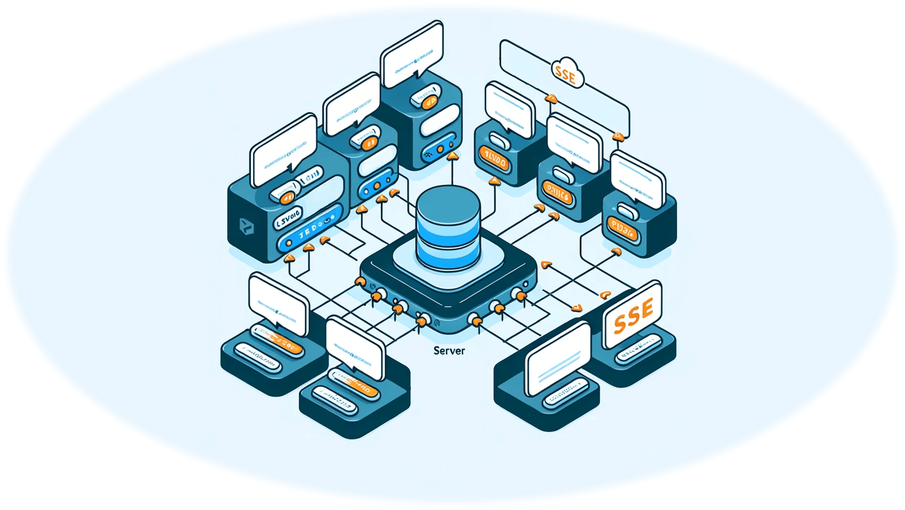

# PubSub-SSE

## Overview

PubSub-SSE is a Go-based server-sent events (SSE) publication and subscription service. It provides real-time data streaming from a server to connected clients using HTTP. This service is particularly useful for applications that require live data updates, such as dashboards, live feeds, or any real-time monitoring system.

## Features

- **Real-Time Data Streaming**: Utilizes SSE to push live data updates to clients.
- **Topic-Based Subscriptions**: Supports public, private, and group topics for targeted data distribution.
- **Dynamic Topic Handling**: Add, remove, subscribe, and unsubscribe from topics at runtime.
- **Flexible Topic Hierarchy**: Topics can have nested subtopics for granular control.
- **Client Management**: Add and remove clients dynamically.

## How It Works

The service uses Go's net/http package to handle SSE connections. Clients receive JSON-formatted data, consisting of system events (sys) and data updates (updates). The data format includes information about topics (public, private, group), subscribed topics, and updated data for subscribed topics.
Topic Types

- **Public Topics**: Visible and subscribable by all clients.
- **Private Topics**: Exclusive to individual clients.
- **Group Topics**: Shared among clients in the same group.

## Topic Subscription Hierarchy

- **Subscribing** to a topic also includes all its subtopics.
- **Topics** and subtopics can be nested indefinitely.

## Contribute

Contributions to extend or improve the PubSub-SSE are welcome. Please follow standard Go coding practices and provide documentation for new features.