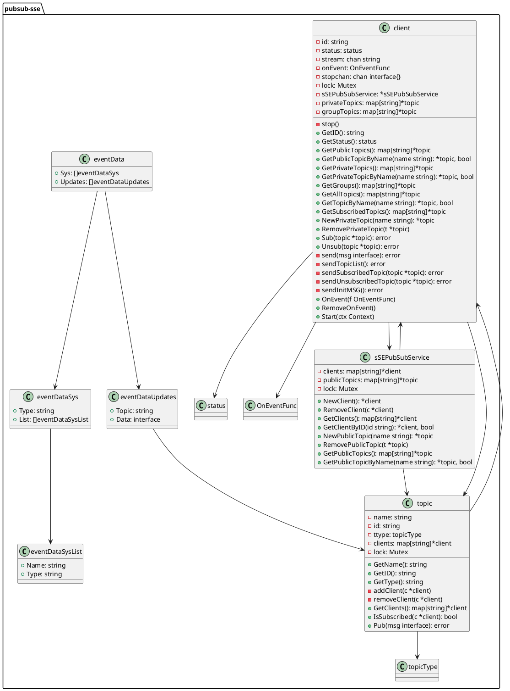

# PubSub-SSE


## Overview

PubSub-SSE is a Go-based server-sent events (SSE) publication and subscription service. It provides real-time data streaming from a server to connected clients using HTTP. This service is particularly useful for applications that require live data updates, such as dashboards, live feeds, or any real-time monitoring system.

## Features

- **Real-Time Data Streaming**: Utilizes SSE to push live data updates to clients.
- **Topic-Based Subscriptions**: Supports public, private, and group topics for targeted data distribution.
- **Dynamic Topic Handling**: Add, remove, subscribe, and unsubscribe from topics at runtime.
- **Flexible Topic Hierarchy**: Topics can have nested subtopics for granular control.
- **Client Management**: Add and remove clients dynamically.

## How It Works

The service uses Go's net/http package to handle SSE connections. Clients receive JSON-formatted data, consisting of system events (sys) and data updates (updates). The data format includes information about topics (public, private, group), subscribed topics, and updated data for subscribed topics.
Topic Types

- **Public Topics**: Visible and subscribable by all clients.
- **Private Topics**: Exclusive to individual clients.
- **Group Topics**: Shared among clients in the same group.

## Topic Subscription Hierarchy

- **Subscribing** to a topic also includes all its subtopics.
- **Topics** and subtopics can be nested indefinitely.

## Contribute

Contributions to extend or improve the PubSub-SSE are welcome. Please follow standard Go coding practices and provide documentation for new features.


# Dev Docs

## Server side (golang)

### Usage
```go
func main() {
	// Create a new SSEPubSubService
	ssePubSub := NewSSEPubSubService()

	// Handle endpoints
	// You can write your own endpoints if you want. Just have a look at the examples and modify them to your needs.
	http.HandleFunc("/add/user", func(w http.ResponseWriter, r *http.Request) { AddClient(ssePubSub, w, r) })                 // Add client endpoint
	http.HandleFunc("/add/topic/public/", func(w http.ResponseWriter, r *http.Request) { AddPublicTopic(ssePubSub, w, r) })   // Add topic endpoint
	http.HandleFunc("/add/topic/private/", func(w http.ResponseWriter, r *http.Request) { AddPrivateTopic(ssePubSub, w, r) }) // Add topic endpoint
	http.HandleFunc("/sub", func(w http.ResponseWriter, r *http.Request) { Subscribe(ssePubSub, w, r) })                      // Subscribe endpoint
	http.HandleFunc("/unsub", func(w http.ResponseWriter, r *http.Request) { Unsubscribe(ssePubSub, w, r) })                  // Unsubscribe endpoint
	http.HandleFunc("/event", func(w http.ResponseWriter, r *http.Request) { Event(ssePubSub, w, r) })                        // Event SSE endpoint
	go func() {
		log.Fatal(http.ListenAndServe(":8080", nil)) // Start http server
	}()

	// Create a new client and get it by id
	client := ssePubSub.NewClient()
	client, _ = ssePubSub.GetClientByID(client.GetID())
	fmt.Println("Client ID:", client.GetID())

	// Create a public topic
	pubTopic := ssePubSub.NewPublicTopic("server/status")

	// Get topic by name. 3 ways to get a public topic:
	pubTopic, _ = ssePubSub.GetPublicTopicByName("server/status")
	pubTopic, _ = client.GetTopicByName("server/status")
	pubTopic, _ = client.GetPublicTopicByName("server/status")

	// Subscribe to the topic
	client.Sub(pubTopic)

	// Send data to the topic
	pubTopic.Pub(TestData{Testdata: "testdata"})

	// Unsubscribe from topic
	client.Unsub(pubTopic)

	// Remove public topic
	ssePubSub.RemovePublicTopic(pubTopic)

	// Create a private topic
	privTopic := client.NewPrivateTopic("test/server")

	// Get topic by name. 2 ways to get a private topic:
	privTopic, _ = client.GetTopicByName("test/server")
	privTopic, _ = client.GetPrivateTopicByName("test/server")

	// Subscribe to the topic
	client.Sub(privTopic)

	// Send data to the topic
	privTopic.Pub(TestData{Testdata: "testdata"})

	// Unsubscribe from topic
	client.Unsub(privTopic)

	// Remove private topic
	client.RemovePrivateTopic(privTopic)

	// Remove client
	ssePubSub.RemoveClient(client)

    //----------------------------
    // PLANED FOR FUTURE VERSIONS
    //----------------------------

	// // Create a group
	// group := ssePubSub.NewGroup("testgroup")
	// group, _ = ssePubSub.GetGroupByName("testgroup")

	// // Add client to group
	// group.AddClient(client)

	// // Get group from client
	// group, _ = client.GetGroupByName("testgroup")

	// // Create a group topic
	// groupTopic := group.NewTopic("test/group")

	// // Get topic by name. 3 ways to get a group topic:
	// groupTopic, _ = group.GetTopicByName("test/group")
	// groupTopic, _ = client.GetTopicByName("test/group")
	// groupTopic, _ = client.GetGroupTopicByName("test/group")

	// // Subscribe to the topic
	// client.Sub(groupTopic)

	// // Send data to the topic
	// groupTopic.Pub(TestData{Testdata: "testdata"})

	// // Unsubscribe from topic
	// client.Unsub(groupTopic)

	// // Remove group topic
	// group.RemoveTopic(groupTopic)

	// // Remove client from group
	// group.RemoveClient(client)

	// // Remove group
	// client.RemoveGroup(group)

    //----------------------------
    // PLANED FOR FUTURE VERSIONS
    //----------------------------

	time.Sleep(500 * time.Second)
}
```

### Code structure


## Browser/Client side

### Explanation of Data Received by the Browser Client via SSE:

The SSE (Server-Sent Events) mechanism in this service sends real-time updates to the browser client in JSON format. 
The structure of the data received by the client is divided into two main parts: 'sys' and 'updates'.

**1. 'sys' (System Events):**
   - This section provides metadata about the topics and the client's subscription status.
   - It contains arrays of topics categorized by their type: 'topics', 'subscribed', and 'unsubscribed'.
     a. 'topics': Lists all available topics (public, private, and group).
     b. 'subscribed': Event which indicates topics the client has recently subscribed to.
     c. 'unsubscribed':  Event which indicates topics the client has recently unsubscribed from.
   - Each topic in these lists includes its 'name'.
   - The 'topics' list also includes the 'type' of each topic, which can be 'public', 'private', or 'group'.

**2. 'updates' (Data Updates):**
   - This part contains the actual data updates for the topics the client is subscribed to.
   - It is an array of objects, each representing an update for a specific topic.
   - Each update object includes:
     a. 'topic': The name of the topic being updated.
     b. 'data': The new data for the topic, encapsulated in a nested JSON object.
     
**3. Note on Topics:**
   - Topics are case sensitive and adhere to a naming convention that includes alphabets, numbers, and underscores.
   - Topics support hierarchical structuring using slashes ('/'), allowing nested subtopics.
   - Subscribing to a higher-level topic automatically subscribes the client to all its nested subtopics.

**4. Note on Data Transmission:**
   - Only changes are sent to the client to minimize data transfer.
   - When a topic is added or removed, the entire updated 'sys' list is sent.
   - Subscriptions and unsubscriptions are communicated through respective 'sys' lists.
   - Updates are sent only for those topics which have new data.

## Examples of JSON messages received by the client:
**1. Example: Empty**: 
   ```json
   {"sys": null, "updates": null}
   ```
   - Indicates no system updates or data updates are available at the moment.

**2. Example:  Data Update**:
   ```json
   {
     "sys": null,
     "updates": [
       {
         "topic": "exampleTopic",
         "data": {"key": "value"}
       }
     ]
   }
   ```
   - Demonstrates a scenario where there is a new data update for a subscribed topic.
   - The data field can contain any valid JSON object.

**3. Example: Subscribing to a Topic**
   - When a client subscribes to a topic, the system updates the 'sys.subscribed' list and sends it to the client.
   - Example JSON message upon subscription:
   ```json
     {
       "sys": {
         "subscribed": [
           {"name": "exampleTopic", "type": "public"}
         ]
       },
       "updates": null
     }
   ```
   - This indicates the client has successfully subscribed to "exampleTopic".
   - If the client is subscribed to multiple topics, they are not shown in this message. This message only shows 
     the topic the client has subscribed to most recently.

**4. Example: Unsubscribing from a Topic**
   - Upon unsubscribing from a topic, the system updates the 'sys.unsubscribed' list.
   - Example JSON message upon unsubscription:
   ```json
     {
       "sys": {
         "unsubscribed": [
           {"name": "exampleTopic", "type": "public"}
         ]
       },
       "updates": null
     }
   ```
   - This indicates the client has unsubscribed from "exampleTopic".
   - This message shows the topic the client has unsubscribed from most recently.

**5. Example: Creating a New Topic**
   - When a new topic is created, the full list of topics is updated and sent to the client.
   - Example JSON message upon new topic creation:
   ```json
     {
       "sys": {
         "topics": [
           {"name": "newTopic", "type": "public"},
           {"name": "existingTopic", "type": "private"}
           ... other existing topics
         ]
       },
       "updates": null
     }
   ```
   - This shows "newTopic" has been added to the list of available topics.

**6. Example: Deleting a Topic**
   - When a topic is deleted, the system updates the 'sys.topics' list excluding the deleted topic.
   - Additionally, if any clients were subscribed to the deleted topic, it will appear in their 'sys.unsubscribed' list.
   - Example JSON message upon topic deletion:
   ```json
     {
       "sys": {
         "topics": [
           List of remaining topics after deletion
         ],
         "unsubscribed": [
           {"name": "deletedTopic", "type": "public"}
         ]
       },
       "updates": null
     }
   ```
   - This indicates "deletedTopic" has been removed, and clients subscribed to it are informed of the unsubscription.

These examples demonstrate the JSON structure the client receives in different scenarios related to topic management. 
The design ensures that clients are always informed about their subscription status and the availability of topics, 
enabling dynamic and responsive interactions with the SSEPubSubService.
