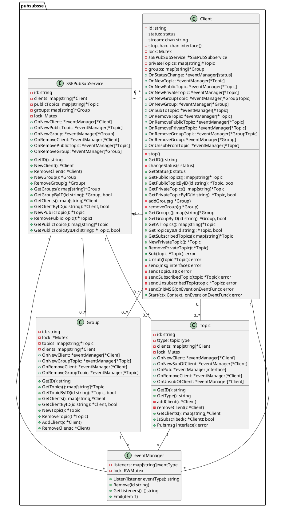

# PubSub-SSE


[](https://github.com/bigbluebutton-bot/pubsub-sse/actions/workflows/go.yml/badge.svg)
[](https://goreportcard.com/report/bigbluebutton-bot/pubsub-sse)
[](https://github.com/bigbluebutton-bot/pubsub-sse/tags/)
[](https://opensource.org/licenses/MIT)
[](https://godoc.org/github.com/bigbluebutton-bot/pubsub-sse)


## Overview

PubSub-SSE is a Go-based server-sent events (SSE) publication and subscription service. It provides real-time data streaming from a server to connected clients using HTTP. This service is particularly useful for applications that require live data updates, such as dashboards, live feeds, or any real-time monitoring system.

## Features

- **Real-Time Data Streaming**: Utilizes SSE to push live data updates to clients.
- **Topic-Based Subscriptions**: Supports public, private, and group topics for targeted data distribution.
- **Dynamic Topic Handling**: Add, remove, subscribe, and unsubscribe from topics at runtime.
- **Client Management**: Add and remove clients dynamically.
- **Event based**: Events are sent to clients only when there is a change in the data.

## How It Works

The service uses Go's net/http package to handle SSE connections. Clients receive JSON-formatted data, consisting of system events (sys) and data updates (updates). The data format includes information about topics (public, private, group), subscribed topics, and updated data for subscribed topics.
Topic Types:

- **Public Topics**: Visible by all clients.
- **Private Topics**: Exclusive to individual clients.
- **Group Topics**: Shared among clients in the same group.

## Topic Subscription

- **Subscribing** to a topic means receiving updates for that topic.
- **Unsubscribing** from a topic stops receiving updates for that topic.

## Contribute

Contributions to extend or improve the PubSub-SSE are welcome. Please follow standard Go coding practices and provide documentation for new features.


# Dev Docs

## Server side (golang)

### Usage
Have a look at the `main.go` file to see how to use the PubSub-SSE service:
[main.go](https://github.com/bigbluebutton-bot/pubsub-sse/blob/main/_example/main.go)

#### Create new instance of the SSEPubSubService
```go
ssePubSub := pubsubsse.NewSSEPubSubService()
http.Handle("/", http.FileServer(http.Dir("./web")))
http.HandleFunc("/add/user", func(w http.ResponseWriter, r *http.Request) { pubsubsse.AddClient(ssePubSub, w, r) })
http.HandleFunc("/add/topic/public/", func(w http.ResponseWriter, r *http.Request) { pubsubsse.AddPublicTopic(ssePubSub, w, r) })
http.HandleFunc("/sub", func(w http.ResponseWriter, r *http.Request) { pubsubsse.Subscribe(ssePubSub, w, r) })
http.HandleFunc("/unsub", func(w http.ResponseWriter, r *http.Request) { pubsubsse.Unsubscribe(ssePubSub, w, r) })
http.HandleFunc("/event", func(w http.ResponseWriter, r *http.Request) { pubsubsse.Event(ssePubSub, w, r) })
go func() {
    err := http.ListenAndServe(":8080", nil)
    if err != nil {
        log.Fatalf("[sys]: %s", err.Error())
    }
}()
```

#### Example of creating a client and subscribing to a public topic
```go
client := ssePubSub.NewClient()
pubTopic := ssePubSub.NewPublicTopic()
client.Sub(pubTopic)
pubTopic.Pub(TestData{Testdata: "testdata"})
client.Unsub(pubTopic)
ssePubSub.RemovePublicTopic(pubTopic)
```

#### Example of creating a client and subscribing to a private topic
```go
client := ssePubSub.NewClient()
privTopic := ssePubSub.NewPrivateTopic()
client.Sub(privTopic)
privTopic.Pub(TestData{Testdata: "testdata"})
client.Unsub(privTopic)
ssePubSub.RemovePrivateTopic(privTopic)
```

#### Example of creating a group and subscribing to a group topic
```go
group := ssePubSub.NewGroup()
group.AddClient(client)
groupTopic := group.NewTopic()
client.Sub(groupTopic)
groupTopic.Pub(TestData{Testdata: "testdata"})
group.RemoveTopic(groupTopic)
group.RemoveClient(client)
ssePubSub.RemoveGroup(group)
```

#### Event Handling
```go
eventid := ssePubSub.OnNewClient.Listen(func(c *pubsubsse.Client) {
    log.Infof("[sys]: New client: %s", c.GetID())
    c.Sub(pubTopic) // exmaple
})

// Get list of events of OnNewClient
events := ssePubSub.OnNewClient.GetListeners()

// Remove the event listener
ssePubSub.OnNewClient.Remove(eventid)
```
There are several events that can be listened to:

##### SSEPubSubService:
- `OnNewClient`: Triggered when a new client is created.
- `OnNewPublicTopic`: Triggered when a new public topic is created.
- `OnNewGroup`: Triggered when a new group is established.
- `OnRemoveClient`: Triggered when a client is removed from the service.
- `OnRemovePublicTopic`: Triggered when a public topic is deleted.
- `OnRemoveGroup`: Triggered when a group is deleted.

##### Client:
- `OnStatusChange`: Triggered when there's a change in the client's connection status.
- `OnNewTopic`: Triggered when any new topic is created for this client.
- `OnNewPublicTopic`: Triggered when a new public topic is created.
- `OnNewPrivateTopic`: Triggered when a new private topic is created for this client.
- `OnNewGroupTopic`: Initiated when a new topic is created within a group for this client.
- `OnNewGroup`: Triggered when this client joins a new group.
- `OnSubToTopic`: Triggered when this client subscribes to a topic.
- `OnRemoveTopic`: Triggered when any topic is removed for this client.
- `OnRemovePublicTopic`: Triggered when a public topic is removed.
- `OnRemovePrivateTopic`: Triggered when a private topic is removed for this client.
- `OnRemoveGroupTopic`: Triggered when a topic within a group of this client is deleted.
- `OnRemoveGroup`: Triggered when a group is removed from the client.
- `OnUnsubFromTopic`: Triggered when this client unsubscribes from a topic.

##### Group:
- `OnNewClient`: Triggered when a new client joins this group.
- `OnNewGroupTopic`: Triggered when a new topic is created within this group.
- `OnRemoveClient`: Triggered when a client is removed from this group.
- `OnRemoveGroupTopic`: Triggered when a group topic is removed from this group.

##### Topic:
- `OnNewClient`: Triggered when a client subscribes to this topic.
- `OnNewSubOfClient`: Triggered when a new subscription is made by a client to this topic.
- `OnPub`: Triggered when a publication is made to this topic.
- `OnRemoveClient`: Triggered when a client is removed from this topic.
- `OnUnsubOfClient`: Triggered when a client unsubscribes from this topic.

## Browser/Client side

### Explanation of Data Received by the Browser Client via SSE:

The SSE (Server-Sent Events) mechanism in this service sends real-time updates to the browser client in JSON format. 
The structure of the data received by the client is divided into two main parts: 'sys' and 'updates'.

**1. 'sys' (System Events):**
   - This section provides metadata about the topics and the client's subscription status.
   - It contains arrays of topics categorized by their type: 'topics', 'subscribed', and 'unsubscribed'.
     a. 'topics': Lists all available topics (public, private, and group).
     b. 'subscribed': Event which indicates topics the client has recently subscribed to.
     c. 'unsubscribed':  Event which indicates topics the client has recently unsubscribed from.
   - Each topic in these lists includes its 'ID'.
   - The 'topics' list also includes the 'type' of each topic, which can be 'public', 'private', or 'group'.

**2. 'updates' (Data Updates):**
   - This part contains the actual data updates for the topics the client is subscribed to.
   - It is an array of objects, each representing an update for a specific topic.
   - Each update object includes:
     a. 'topic': The ID of the topic being updated.
     b. 'data': The new data for the topic, encapsulated in a nested JSON object.

**3. Note on Data Transmission:**
   - Only changes are sent to the client to minimize data transfer.
   - When a topic is added or removed, the entire updated 'sys' list is sent.
   - Subscriptions and unsubscriptions are communicated through respective 'sys' lists.
   - 'subscribed' and 'unsubscribed' is not a list of all topics the client is subscribed to, but only the most recent one.
   - Updates are sent only for those topics which have new data.

## Examples of JSON messages received by the client:
**1. Example: Empty**: 
   ```json
   {"sys": null, "updates": null}
   ```
   - Indicates no system updates or data updates are available at the moment.
   - Normaly this isn't sent to the client. This is just an example for understanding.

**2. Example: Creating a New Topic**
   - When a new topic is created, the full list of topics is updated and sent to the client.
   - Example JSON message upon new topic creation:
   ```json
  {
      "sys": [{
          "type": "topics",
          "list": [
              {"id": "T-6c485efd-ec63-4cef-927f-3d93387f5473", "type": "public"},
              {"id": "T-9876a811-b2ea-4bdf-afc7-9c5c83fb4cda", "type": "private"},
              {"id": "T-e054fcae-8011-496f-af6f-76f97870a3e3", "type": "group"}
          ]
      }],
      "updates": null
  }
   ```
   - This shows "newTopic" has been added to the list of available topics.

**3. Example: Deleting a Topic**
   - When a topic is deleted, the system updates the 'sys.topics' list excluding the deleted topic.
   - Additionally, if any clients were subscribed to the deleted topic, it will appear in their 'sys.unsubscribed' list.
   - The topic doesnt exist enymore for this client. It can't subscribe to it.
   - Example JSON message upon topic deletion:
   ```json
  {
      "sys": [{
          "type": "topics",
          "list": [
              {"id": "T-6c485efd-ec63-4cef-927f-3d93387f5473", "type": "public"},
              {"id": "T-9876a811-b2ea-4bdf-afc7-9c5c83fb4cda", "type": "private"}
          ]
      }, {
          "type": "unsubscribed",
          "list": [{"id": "T-e054fcae-8011-496f-af6f-76f97870a3e3"}]
      }]
      "updates": null
  }
   ```
   - This indicates `{"id": "T-e054fcae-8011-496f-af6f-76f97870a3e3", "type": "group"}` has been removed, and clients subscribed to it are informed of the unsubscription.


**4. Example: Subscribing to a Topic**
   - When a client subscribes to a topic, the system updates the 'sys.subscribed' list and sends it to the client.
   - This list only contains the most recent subscription. Not the full list of topics the client is subscribed to. If the client is subscribed to multiple topics, they are not shown in this message.
   - Example JSON message upon subscription:
   ```json
    {
        "sys": [{
            "type": "subscribed",
            "list": [{"id": "T-6c485efd-ec63-4cef-927f-3d93387f5473"}]
        }],
        "updates": null
    }
   ```
   - This indicates the client has successfully subscribed to "exampleTopic".

**5. Example:  Data Update**:
   ```json
    {
        "sys": null,
        "updates": [{"topic": "T-6c485efd-ec63-4cef-927f-3d93387f5473", "data": "DATAAAAAA"}]
    }
   ```
   - Demonstrates a scenario where there is a new data update for a subscribed topic.
   - The data field can contain any valid JSON object.

**6. Example: Unsubscribing from a Topic**
   - Upon unsubscribing from a topic, the system updates the 'sys.unsubscribed' list.
   - This list only contains the most recent unsubscription. Not the full list of topics the client is unsubscribed from. If the client has unsubscribed from multiple topics, they are not shown in this message.
   - The topic still exists in the 'sys.topics' list, but the client is no longer subscribed to it. It can resubscribe if needed.
   - Example JSON message upon unsubscription:
   ```json
  {
      "sys": [{
          "type": "unsubscribed",
          "list": [{"id": "T-6c485efd-ec63-4cef-927f-3d93387f5473"}]
      }],
      "updates": null
  }
   ```
   - This indicates the client has unsubscribed from "T-6c485efd-ec63-4cef-927f-3d93387f5473".

These examples demonstrate the JSON structure the client receives in different scenarios related to topic management. 
The design ensures that clients are always informed about their subscription status and the availability of topics, 
enabling dynamic and responsive interactions with the SSEPubSubService.

## Code structure
